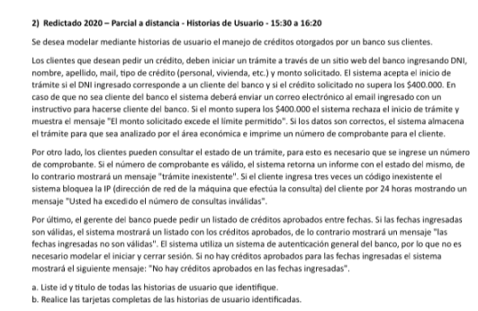

# Ingenieria de Software 1 - UNLP 2026

## Parciales resueltos de Historia de Usuario

### Parcial 1:  Seguimiento de licencias solicitadas

HU_01:
*ID:*  Solicitar licencia
*TITULO*: Como Empleado registrado quiero solicitar una licencia médica para justificar mis inasistencias y realizar el reposo adecuado.
*REGLAS DE NEGOCIO:*
    - el empleado debe tener más de 1 mes de antiguedad
    - el empleado no debe poseer licencias medicas vigentes

*CRITERIOS DE ACEPTACION:*
*Escenario 1:*  Solicitud de licencia exitosa
    DADO el empleado registrado de cuil 20-25421650-1, autenticado en el sistema, tiene 2 años de antiguedad y no posee licencias vigentes.
    CUANDO el empleado registrado ingresa cuil 20-25421650-1, tipo de licencia "presencial", fecha de inicio 05-06-2026, matricula medico 23265-1, diagnostico "Esguince de tobillo", seleccionar "Titular" y presiona "solicitar licencia"
    ENTONCES el sistema registra la solicitud y genera un codigo de licencia que envia por mail a la casilla del empleado junto con la confirmacion y dias otorgados.

*Escenario 2:*  Solicitud de licencia fallida por antiguedad insuficiente
    DADO el empleado registrado de cuil 20-94120040-1, autenticado en el sistema pero con antiguedad de 15 dias
    CUANDO el empleado registrado ingresa cuil 20-94120040-1, tipo de licencia "presencial", fecha de inicio 15-05-2026, matricula medico 50632-1, diagnostico "Gripe fuerte", salecciona "Titular" y presiona "solicitar licencia"
    ENTONCES el sistema deniega la solicitud e informa: "Solicitud de licencia rechazado por incumplimiento de antiguedad"

*Escenario 3:*  Solicitud de licencia fallida por poseer licencias vigentes
    DADO el empleado registrado de cuil 20-41899078-1, autenticado en el sistema pero con licencias vigentes
    CUANDO el empleado registrado ingresa cuil 20-41899078-1, tipo de licencia "presencial", fecha de inicio 12-05-2026, matricula medico 96035-1, diagnostico "Lumbalgia agudad", selcciona "familiar" y presionar "solicitar licencia"
    ENTONCES el sistema deniega la solicitud e informa: "Solicitud de licencia rechazado por poseer licencias vigentes"

HU_02:
*ID:*  Consultar licencias solicitadas
*TITULO*: Como Empleado administrativo quiero consultar las licencias solicitadas por un empleado para llevar adelante un control mensual de presentismo.
*REGLAS DE NEGOCIO:*
    - Solo se permite la impresion de un informe por mes por cada empleado.

*CRITERIOS DE ACEPTACION:*
*Escenario 1:*  Consulta de licencias exitosa
    //DADO que el empleado administrativo se encuentra autenticado y el CUIL 20-54812450-1 no registra informes impresos en el mes actual// PREGUNTAR SI VA DE ESTA FORMA?, 

    DADO el cuil 20-54812450-1 sin informe generado en el mes presente
    CUANDO el empleado administrativo ingresa cuil empleado 20-54812450-1, rango de fechas "05-03-2026" a "25-03-2026" y presiona "consultar licencias solicitadas"
    ENTONCES el sistema imprime un informe de las licencias solicitadas.

*Escenario 2:*  Consulta de licencias fallido por limite de informe alcanzado
    DADO el cuil 20-28321542-1 ya registra un informe impreso en el mes actual
    CUANDO el empleado administrativo ingresa cuil empleado 20-28321542-1, rango de fechas "01-02-2026" a "28-02-2026" y presiona "consultar licencias solicitadas"
    ENTONCES el sistema deniega el informe y notifica: "empleado ya cuenta con informe impreso en el mes"

### Parcial 2:  Gestion de turnos entre pacientes y profesionales
ENUNCIADO:
Te paso el enunciado de un parcial de HISTORIA DE USUARIO:
Una clinica medica privada desea desarrollar una aplicacion web para facilitar la gestion de turnos entre pacientes y profesionales de la salud. En la actualidad, los turnos se asignan unicamente de manera telefonica, lo que provoca demoras, errores y sobrecarga del personal administrativo.
La nueva solucion permitira a los pacientes autogestionar sus turnos y a los medicos administrar sus agendas de forma autonoma.
Para solicitar un turno, un paciente debe estar registrado y autenticado previamente (el registro y autenticacion no debe modelarse).
Los pacientes podran solicitar turnos con medicos de distintas especialidades, indicando, especialidad, medico, dia y hora. El sistema debe permiter que el paciente solicite solo un turno por especialidad por semana. Para poder solicitar un turno el paciente debe ser mayor a 18 años.
Los medicos registrados, previa autenticacion (el registro y la autenticacion no deben modelarse), podran ingresar a su panel para ver sus turnos. Para ello deberan ingresar una fecha y el sistema debera listar todos los turnos activos en esa fecha. El sistema debe permitir ingresar solo fechas del corriente año.

- Roles: Paciente registrado y Medico registrado.
- Requerimientos: Solicitar turno y Ver turnos.

HU_01:
*ID:*  Solicitar turnos
*TITULO*: Como paciente registrado quiero solicitar un turno medico para ser diagnosticado por mi malestar.
*REGLAS DE NEGOCIO:*
    - solo se permiten pacientes con edad mayor a 18 años.
    - solo se permite por paciente, un turno por especialidad en la semana.

*CRITERIOS DE ACEPTACION:*
*Escenario 1:*  solicitud exitoso
    DADO un paciente registrado, autenticado en el sistema, con edad de 21 años y con la especialidad no solicitada en la semana 
    CUANDO el paciente registrado ingresa especilidad "Cardiologia", medico "Gonzalez", dia "Jueves", hora "15 hs pm" y presiona "solicitar turno"
    ENTONCES el sistema registra el turno solicitado e informa la confirmacion al paciente.

*Escenario 2:*  solicitud fallida por ser menor de edad
    DADO un paciente registrado, autenticado en el sistema y con edad de 17 años.
    CUANDO el paciente registrado ingresa especilidad "Neurologia", medico "Flores", dia "Viernes", hora "17 hs pm" y presiona "solicitar turno"
    ENTONCES el sistema deniega la solicitud e informa: "Error de solicitud, debe ser mayor a 18 años"

*Escenario 3:*  solicitud fallida por limite de especialidad alcanzada
    DADO un paciente registrado, autenticado en el sistema, con edad de 30 años y con la especialidad ya solicitado en la semana
    CUANDO el paciente registrado ingresa especilidad "Dermatologia", medico "Lopez" dia "Lunes", hora "16 hs pm" y presiona "solicitar turno"
    ENTONCES el sistema deniega la solicitud e informa: "Error, se llego al limite de solicitud para la especialidad en la semana"

HU_02:
*ID:*  Ver turnos
*TITULO*: Como medico registrado quiero ver mis turnos registrados para gestionar mi agenda.
*REGLAS DE NEGOCIO:*
    - solo se permiten fechas del año corriente

*CRITERIOS DE ACEPTACION:*
*Escenario 1:*  Ver turnos exitoso
    DADO un medico registrado, autenticado en el sistema y las fecha selecciona corresponde al año corriente
    CUANDO el medico registrado ingresa fecha "20-05-2026" y presiona "Ver turnos"
    ENTONCES el sistema informa el listado de los turnos activos para la fecha.

*Escenario 2:*  Ver turnos fallido por fecha fuera del año corriente
    DADO un medico registrado, autenticado en el sistema y las fecha selecciona no corresponde al año corriente
    CUANDO el medico registrado ingresa fecha "20-05-2027" y presiona "Ver turnos"
    ENTONCES el sistema informa "Solo se permite ingresar fechas del año corriente".

### Parcial 3:  Cadena de gimnasios

HU_01:
*ID:*  Solicitar turno
*TITULO*: Como socio registrado quiero solicitar turno para reservar mi lugar en el gimnasio
*REGLAS DE NEGOCIO:*
    - el socio debe tener su cuota al dia.
    - Debe haber cupo disponible para la clase, dia y hora seleccionados.

*CRITERIOS DE ACEPTACIÓN:*
*Escenario 1:* Solicitud de turno exitoso
    DADO un socio registrado que esta autenticado en el sistema y con la cuota del gimnasio al dia
    CUANDO el socio registrado ingresa sede "GYM 07", clase "funcional", dia "Lunes", hora "18:00" y presiona "Solicitar turno"
    ENTONCES el sistema registra la reserva e informa la confirmacion con los datos del turno.

*Escenario 2:* Solicitud de turno fallido por cuota adeudada
    DADO un socio registrado que esta autenticado en el sistema pero registra una deuda en su cuota
    CUANDO el socio registrado ingresa sede "GYM 12", clase "PIlates", dia "Martes", hora "17:00" y presiona "Solicitar turno"
    ENTONCES el sistema deniega la solicitud e informa: "Para solicitar turno debe estar al dia con la cuota".

*Escenario 3:* Solicitud de turno fallido por cupo agotado
    DADO un socio registrado que esta autenticado en el sistema pero el cupo agotado para la clase, dia y hora 
    CUANDO el socio registrado ingresa sede "GYM 04", clase "Funcional", dia "Viernes", hora "21:00" y presiona "Solicitar turno"
    ENTONCES el sistema deniega la solicitud e informa: "Cupo no disponible para la actividad y hora selccionada".

HU_02:
*ID:*  Cancelar turno
*TITULO*: Como socio registrado quiero cancelar mi turno para liberar el cupo y permitir que otros socios puedan utilizar el lugar.
*REGLAS DE NEGOCIO:*
    - La cancelacion solo es permitida con una anticipacion minima de 1 hora respecto al inicio de la clase.

*CRITERIOS DE ACEPTACIÓN:*
*Escenario 1:* Cancelacion exitosa
    DADO un socio registrado que esta autenticado en el sistema y con las condiciones de cancelacion son adecuadas
    CUANDO el socio registrado ingresa dia "Lunes", hora "18:00" y presiona "Cancelar turno"
    ENTONCES el sistema libera el cupo, registra la cancelacion e informa "Cancelacion de turno exitoso".

*Escenario 2:* Cancelacion fallida por no cumplir el tiempo de anticipacion
    DADO un socio registrado que esta autenticado en el sistema y con las condiciones de cancelacion no adecuadas
    CUANDO el socio registrado ingresa dia "Lunes", hora "18:00" y presiona "Cancelar turno"
    ENTONCES el sistema deniega la cancelacion e informa "La cancelacion debe realizar con 1 hora de anticipacion al horario de clase"

HU_03:
*ID:*  Crear clase
*TITULO*: Como administrador registrado quiero crear nuevas clases para mantener actualizada la oferta de actividades
*REGLAS DE NEGOCIO:*
    - No se permiten clases superpuestas en la misma sala, dia y hora.
    - Un instructor no puede tener asignados mas de tres clases en un mismo dia

*CRITERIOS DE ACEPTACIÓN:*
*Escenario 1:* Creacion de clase exitosa
    DADO un administrador registrado que esta autenticado en el sistema y la sala "A" esta libre el lunes a las 10hs
    CUANDO el administrador registrado ingresa sede "La plata", clase "Funcional", sala "A", dni instructor 91256413, capacidad maxima 20, dia "Lunes", hora "10:00" y presiona "Crear clase"
    ENTONCES el sistema registra la clase nueva e informa "Clase nueva creada con exito".

*Escenario 2:* Creacion de clase fallida por sala ocupada
    DADO que en la sala "B" ya existe una clase de "Yoga" el martes a las 16:00hs
    CUANDO el administrador registrado ingresa sede "City bell", clase "Funcional", sala "B", dni instructor 98521563, capacidad maxima 15, dia "Martes", hora "16:00" y presiona "Crear clase"
    ENTONCES el sistema deniega la solicitud e informa "Sala ocupada en el dia y hora seleccionado"

*Escenario 3:* Creacion de clase fallida por limite de instructor alcanzado
    DADO que el instructor con DNI "30.123.456" ya tiene 3 clases programdas para el dia lunes
    CUANDO el administrador registrado ingresa sede "Ringuelet", clase "Crossfit", sala "C", dni instructor "30.123.456", capacidad maxima 30, dia "Lunes", hora "19:00" y presiona "Crear clase"
    ENTONCES el sistema deniega la solicitud e informa "Instructor alcanzo el maximo de clase por dia permitido"

---------------------------------------------------------------------------------------------------------------

### Parcial 4:  Cadena de gimnasios

- ROLES IDENTIFICADOS: PERSONAL DE RECURSOS HUMANOS, PERSONAL CONTABLE
- REQUERIMIENTOS IDENTIFICADOS: CARGAR EMPLEADO, LIQUIDAR INDEMNIZACIÓN

ENUNCIADO:
Suponga que está modelando un módulo para la gestión del personal de una empresa.
El personal de Recursos Humanos de la empresa debe poder registrar a nuevos empleados. Para ello, deberá ingresar los siguientes datos: nombre, apellido, edad, correo electrónico, DNI (no puede haber dos empleados con el mismo DNI), área, categoría (Administrativo o Mantenimiento) y oficina.
Para ingresar a la categoría Mantenimiento, el empleado debe tener entre 18 y 40 años. Para ingresar a la categoría Administrativo, el empleado únicamente debe ser mayor de 18 años.
Una vez registrado el nuevo empleado, el sistema deberá enviarle un correo electrónico de bienvenida junto con un código de empleado generado aleatoriamente. Ante cualquier intento fallido, el sistema deberá informar el motivo correspondiente.
Por otro lado, el personal del área Contable de la empresa debe poder gestionar la liquidación de indemnización en caso de despido de un empleado. Para ello, deberá ingresar el DNI del empleado, el motivo del despido y el monto indemnizatorio.
La indemnización solo podrá liquidarse a empleados con más de un año de antigüedad y por montos inferiores a los 10 millones de pesos.
En caso de que la liquidación pueda llevarse a cabo, deberá registrarse la baja del empleado y enviarle por correo electrónico la notificación de despido, incluyendo el monto indemnizatorio y el motivo correspondiente. En caso contrario, el sistema deberá informar al personal contable por qué no es posible realizar la liquidación.

HU_01:
*ID:* Cargar empleado
*TITULO*: Como personal de recursos humanos quiero cargar un nuevo empleado para incorporarlo a la empresa formalmente y asignarle sus datos de acceso.
*REGLAS DE NEGOCIO:*
    - Si el empleado es categoria "Administrativo", debe ser mayor a 18 años.
    - Si el empleado es categoria "Mantenimiento", debe tener entre 18 y 40 años.
    - El DNI del empleado debe ser único en el sistema (no duplicado).

*CRITERIOS DE ACEPTACIÓN:*
*Escenario 1:* Carga exitosa de Administrativo
    DADO el dni 41251053 no registrado en el sistema y con la edad de 21 años 
    CUANDO el personal de recursos humanos ingresa nombre de empleado "Juan", apellido "Perez", edad 21, mail "juanperez@gmail.com", dni 41251053, area "Atencion al cliente", categoria "Administrativo", oficina "A2" y presiona "Cargar empleado"
    ENTONCES el sistema registra al empleado, envia al mail ingresado mensaje de bienvenida y un codigo de empleado generado aleatoriamente.

*Escenario 2:* Carga exitosa de Mantenimiento 
    DADO el dni 35123456 no registrado en el sistema y con la edad de 30 años 
    CUANDO el personal de recursos humanos ingresa nombre de empleado "Carlos", apellido "Gomez", edad 30, mail "carlosgomez@gmail.com", dni 35123456, area "Infraestructura", categoria "Mantenimiento", oficina "B1" y presiona "Cargar empleado" 
    ENTONCES el sistema registra al empleado, envia al mail ingresado mensaje de bienvenida y un codigo de empleado generado aleatoriamente.

*Escenario 3:* Carga fallida por dni duplicado 
    DADO el dni 41251053 que ya se encuentra registrado en el sistema 
    CUANDO el personal de recursos humanos ingresa nombre de empleado "Luis", apellido "Gomez", edad 30, mail "luisgomez@gmail.com", dni 41251053, area "Infraestructura", categoria "Mantenimiento", oficina "C1" y presiona "Cargar empleado"
    ENTONCES el sistema deniega el registro e informa el motivo: "Error: El DNI ingresado ya pertenece a un empleado en el sistema" *CONSULTAR ACA*

*Escenario 4:* Carga fallida por edad no requerido en mantenimiento
    DADO un empleado con la edad de 45 años para el área de mantenimiento
    CUANDO el personal de recursos humanos ingresa nombre de empleado "Pedro", apellido "Gonzalez", edad 45, mail "pedrogonzalez@gmail.com", dni 40051053, area "Logistica", categoria "Mantenimiento", oficina "D1" y presiona "Cargar empleado"
    ENTONCES el sistema no realiza el registro e informa "La edad del empleado debe ser entre 18 a 40 años".

*Escenario 5:* Carga fallida por edad no requerido en administrativo
    DADO un empleado con la edad de 16 años para el área de administrativo
    CUANDO el personal de recursos humanos ingresa nombre de empleado "Oscar", apellido "Pereyra", edad 16, mail "oscarpereyra@gmail.com", dni 30058553, area "Finanzas", categoria "Administracion", oficina "A3" y presiona "Cargar empleado"
    ENTONCES el sistema no realiza el registro e informa "La edad del empleado debe ser mayor a 18 años".

HU_02:
*ID:* Liquidar indemnización
*TITULO*: Como personal contable quiero liquidar indemnización de un empleado despedido para registrar su baja formal en el sistema y notificar el pago correspondiente
*REGLAS DE NEGOCIO:*
    - El empleado debe tener al menos 1 año de antiguedad.
    - El monto de indemnizacion debe ser inferior a 10 millones.

*CRITERIOS DE ACEPTACIÓN:*
*Escenario 1:* Liquidacion éxitosa
    DADO el dni 52690123, existente en el sistema, con 3 años de antiguedad y monto de indemnización de 8.000.000 
    CUANDO el personal contable ingresa dni de empleado 52690123, motivo "Inasistencias", monto 8.000.000 y presionar "Liquidar indemnización" 
    ENTONCES el sistema registra la baja del empleado, envia por mail la notificación de despido, incluyendo monto y el motivo. *PREGUNTAR*

*Escenario 2:* Liquidacion fallida por incumplimiento de antiguedad
    DADO el dni 41985060, existente en el sistema, con 8 meses de antiguedad.
    CUANDO el personal contable ingresa dni de empleado 41985060, motivo "Daño material", monto 9.000.000 y presionar "Liquidar indemnización" 
    ENTONCES el sistema informa al personal contable "Liquidacion fallida por incumplimiento de antiguedad"

*Escenario 3:* Liquidacion fallida por monto superio al permitido
    DADO el dni 31852070, existente en el sistema, con monto de indemnizacion de 12.000.000. *PREGUNTAR*
    CUANDO el personal contable ingresa dni de empleado 31852070, motivo "Incumplimiento laboral", monto 12.000.000 y presionar "Liquidar indemnización" 
    ENTONCES el sistema informa al personal contable "Liquidacion fallida por superar al monto establecido"

---------------------------------------------------------------------------------------------------------------

### Parcial 5:  Modelar el manejo de créditos otorgados por un banco a sus clientes

- ROLES IDENTIFICADOS: CLIENTE, GERERNTE
- REQUERIMIENTOS IDENTIFICADOS: INICIAR TRAMITE DE SOLICITUD DE CRÉDITO, CONSULTAR ESTADO DE TRAMITE Y SOLICITAR LISTADO DE CRÉDITOS APROBADOS.

HU_01:
*ID:* Iniciar trámite de solicitud de crédito.
*TITULO*: Como cliente quiero iniciar el trámite de solictud de crédito  para formalizar mi pedido de financiamiento y comenzar el proceso de evaluación crediticia.
*REGLAS DE NEGOCIO:*
    - El dni debe corresponder a un cliente del banco.
    - El monto solicitado no debe superar los $400.000. 

*CRITERIOS DE ACEPTACIÓN:*
*Escenario 1:* inicio de trámite exitoso
    DADO el dni 412304820, correspondiente a un cliente del banco y monto solicitado por $350.000
    CUANDO el cliente ingesa dni 412304820, nombre "Juan", apellido "Lopez", Mail "juanlopez@gmail.com", tipo de credito "Personal", monto solicitado $350.000 y presiona "iniciar trámite de crédito"
    ENTONCES el sistema almacena el trámite e imprime el numero de comprobante correspondiente al trámite para el cliente.

*Escenario 2:* inicio de trámite fallido por DNI no cliente
    DADO el dni 51963041 no correspondiente a un cliente del banco 
    CUANDO el cliente ingesa dni 51963041, nombre "Lucas", apellido "Garcia", Mail "lucasgarcia@gmail.com", tipo de credito "Vivienda", monto solicitado $320.000 y presiona "iniciar trámite de crédito"
    ENTONCES el sistema envia al mail ingresado un instructivo para hacerse cliente del banco.

*Escenario 3:* inicio de trámite fallido por monto no permitido
    DADO el dni 52361024 correspondiente a un cliente y monto solicitado por $550.000
    CUANDO el cliente ingesa dni 52361024, nombre "Jorge", apellido "Diaz", Mail "jorgediaz@gmail.com", tipo de credito "Personal", monto solicitado $550.000 y presiona "iniciar trámite de crédito"
    ENTONCES el sistema informa "El monto solicitado excede al limite permitido".

HU_02:
*ID:* Consultar estado de trámite.
*TITULO*: Como cliente quiero consultar el estado de trámite de mi solicitud de cŕedito para realizar un seguimiento de mi pedido y conocer su resolución final
*REGLAS DE NEGOCIO:*
    - Solo se permiten 3 intentos de error de numeros de comprobantes inexistentes

*CRITERIOS DE ACEPTACIÓN:*
*Escenario 1:* Consulta de estado de trámite exitoso
    DADO un cliente sin fallos registrados y el numero de trámite "V000123" registrado en el sistema
    CUANDO el cliente ingresa numero de trámite "V000123" y presiona "Consultar estado de trámite"
    ENTONCES el sistema envia un informe completo con el estado del trámite.

*Escenario 2:* Consulta de estado de trámite fallido por numero de tramite inexistente 1er fallo
    DADO un cliente sin fallos registrados y el numero de trámite "B000456" no registrado en el sistema
    CUANDO el cliente ingresa numero de trámite "B000456" y presiona "Consultar estado de trámite"
    ENTONCES el sistema informa "Numero de trámite inexistente" y registra el 1er fallo para el cliente.

*Escenario 3:* Consulta de estado de trámite fallido por numero de tramite inexistente 2er fallo
    DADO un cliente con 1 fallo registrado y el numero de trámite "C000789" no registrado en el sistema
    CUANDO el cliente ingresa numero de trámite "C000789" y presiona "Consultar estado de trámite"
    ENTONCES el sistema informa "Numero de trámite inexistente" y registra el 2do fallo para el cliente.

*Escenario 4:* Consulta de estado de trámite fallido por numero de tramite inexistente 3er fallo
    DADO un cliente con 2 fallos registrados y el numero de trámite "D000159" no registrado en el sistema
    CUANDO el cliente ingresa numero de trámite "D000159" y presiona "Consultar estado de trámite"
    ENTONCES el sistema registra el 3er fallo para el cliente, bloquea la IP del mismo por 24 horas e informa "Usted ha excedido el número de consultas inválidas"

*Escenario 5:* Consulta de estado de trámite fallido por bloqueo de IP
    DADO un cliente con la IP actualmente bloquedada por exceso de intentos
    CUANDO el cliente ingresa numero de trámite "A00753" y presiona "Consultar estado de trámite"
    ENTONCES el sistema informa "Usted ha excedido el número de consultas inválidas"

HU_03:
*ID:* Solicitar créditos aprobados.
*TITULO*: Como gerente quiero solicitar los créditos aprobados para analizar el desempeño del área económica y contar con información precisa para la toma de decisiones.
*REGLAS DE NEGOCIO:*
    - Las fechas ingresadas no pueden ser posteriores a la fecha actual
    - El rango de fechas debe ser cronológicamente coherente (FechInicio <= FechaFin)

*CRITERIOS DE ACEPTACIÓN:*
*Escenario 1:* Solicitud de cŕedito aprobados exitoso con créditos.
    DADO el rango de fecha inicio: "22/06/2026", fin: "23/06/2026" permitidos para el sistema con créditos aprobados 
    CUANDO el gerente ingresa fecha inicio "22/06/2026", fecha fin: "23/06/2026" y presiona "Solicitar créditos aprobados" 
    ENTONCES el sistema muestra un listado cno los créditos aprobados.

*Escenario 2:* Solicitud de cŕedito aprobados exitoso sin créditos.
    DADO el rango de fecha inicio: "15/06/2026", fin: "16/06/2026" permitidos para el sistema pero sin créditos aprobados registrados. 
    CUANDO el gerente ingresa fecha inicio "15/06/2026", fecha fin: "16/06/2026" y presiona "Solicitar créditos aprobados" 
    ENTONCES el sistema informa "No hay créditos aprobados en las fechas ingresadas"

*Escenario 3:* Solicitud de cŕedito aprobados fallido por fechas posteriores al actual.
    DADO el rango de fecha inicio: "10/08/2026", fin: "12/08/2026" no permitidos para el sistema 
    CUANDO el gerente ingresa fecha inicio "10/08/2026", fecha fin: "12/08/2026" y presiona "Solicitar créditos aprobados" 
    ENTONCES el sistema informa "Las fechas ingresadas no son válidas".

*Escenario 4:* Solicitud de cŕedito aprobados fallido por incoherencia en las fechas.
    DADO el rango de fecha inicio: "10/06/2026", fin: "05/06/2026" incoherentes para el sistema 
    CUANDO el gerente ingresa fecha inicio "10/06/2026", fecha fin: "05/06/2026" y presiona "Solicitar créditos aprobados" 
    ENTONCES el sistema informa "Las fechas ingresadas no son válidas".

