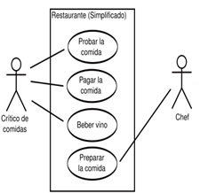
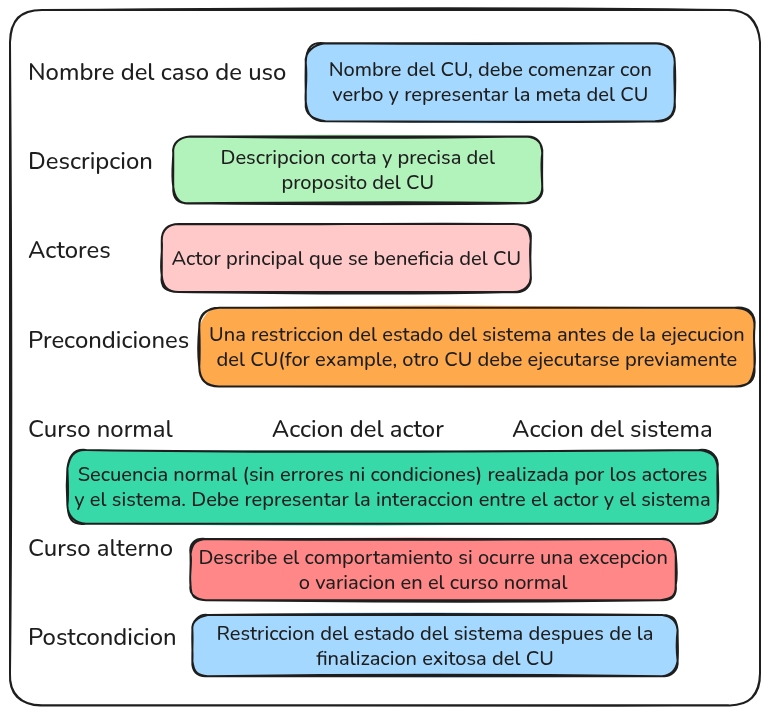

# Ingenieria de Software 1 2025 

## Clase 3 - Teoria:

*_ TEMAS _*

1) Tipos de Requerimientos
2) Ingenieria de Requerimientos
3) Casos de Uso

### TIPOS DE REQUERIMIENTOS:

1) Requerimientos Funcionales: Son las acciones o comportamientos que el sistema debe realizar. Definen lo que el sistema hace, cómo responde a una entrada o situación, y hasta lo que no debe permitir. Se enfocan en la funcionalidad, no en cómo está programada. Este tipo describen QUE HACE EL SISTEMA.

2) Requerimientos NO Funcionales: Describen cómo debe comportarse el sistema en términos de rendimiento, seguridad, disponibilidad, usabilidad, escalabilidad, entre otros. No se enfocan en qué hace el sistema, sino en las condiciones bajo las cuales lo hace. Este tipo describen COMO LO HACE EL SISTEMA.

Example: (funcional) el sistema debe permitir al usuario ingresar con usuario y contraseña; (no funcional) el sistema debe responder a la solicitud de login en menos de 2 segundos.

*ANALOGIA*: Mesero en un restaurante
    * Funcional: tomar pedido, llevar la comida a la mesa, cobrar la cuenta, etc
    * NO Funcional: El pedido lo debe tomar con amabilidad y respeto(usabilidad), debe entregarlo en menos de 10 minutos (rendimiento), el pago debe hacerse de forma segura mediante QR (seguridad), etc.

### INGENIERIA DE REQUERIMIENTOS:

Es el proceso por el cual se transforman los requerimientos declarados por lo clientes, ya sea hablados o escritos, a especificaciones precisas, no ambiguas, consistentes y completas (SRS)

*IMPORTANCIA:*
    * Permite gestionar las necesidades del proyecto en forma estructurada
    * Mejora la capacidad de predecir cronogramas de proyectos
    * Disminuye costos y retrados del proyecto
    * Mejora la calidad del software
    * Mejora la comunicacion entre equipos
    * Evita rechazos de usuarios finales

### VALIDACION DE REQUERIMIENTOS:

Validacion != Verificacion
- La validacion cumple con las necesidades del cliente, es el software esperado y correcto. Este proceso se realiza con los usuarios.
- La verificacion cumple con los requerimientos diseñados y/o escritos, por ejemplo, es la prueba de que una funcionalidad devuelva lo esperado.

### CASOS DE USO:

Proceso de modelado de las "funcionales" del sistema en termino de eventos que interactuan entre los usuarios y el sistema. Este modelado de CASOS DE USO, facilita y alienta la participacion de los usuarios.

Casos de uso: Es una descripcion de como un usuario o sistema, interactua con un sistema para lograr un objetivo especifico, se centra en que quiere lograr el usuario y como el sistema responde.

EXAMPLE SIMPLE CU: 
    * Critico de las comidas: Probar la comida, Pagar la comida, Beber vino
    * Chef: Preparar la comida

Para que el CU sea considerado un requerimiento debe estar acompañado de su respectivo escenario.

- ACTOR: Un actor es un ROL que interactua con el sistema, es quien inicia una actividad en un CASO DE USO. Puede ser una persona, sistema externo o dispositivo externo. Es quien dispara, ejecuta una funcionalidad.

*_ RELACIONES _*
1) Asociaciones: Relacion entre un actor y un CU en el que interactuan entre si
2) Extensiones (Extends): Un CU extiende la funcionalidad de otro CU. 1 Caso de uso puede tener muchos CU extensiones, los CU extendidos solo pueden ser iniciados por un CU
3) Uso o Inclusión (Uses): Reduce la redundancia entre dos o mas CU al combinmar los pasos comunes de los CU
4) Herencia: Es el caso donde 2 actores heredan funcionalidad de 1 actor padre.

Cuando un caso de uso solo precisa otro caso de uso es extendes, pero cuando mas de 1 caso de uso precisa otro caso de uso es USE.
Podemos tener el caso, donde mas de 1 actor inicie un caso de uso pero no es lo correcto, ahi viene la jerarquia de herencia.

*_ ESCENARIOS _*
En los escenarios se describen la interaccion del escenario y eventos alternativos
ESECENARIO CASO DE USO -> 

PASOS DE MODELADO: Identificar a los actores, identificar los CU para los requerimientos, Construir el diagrama y realizar los escenarios.

## APUNTES EN CLASE:

Es otra tecnica de especificacion de requerimientos como Historia de Usuario. Es el proceso de modelar las funcionales de como interactua el usuario con el sistema, el flujo de como se lleva a cabo x requerimiento
Tenemos:
1) Diagramas de caso de uso: todos los actores que actuan.
2) Escenarios de caso de uso: es la descripcion de cada caso de uso.

Cada historia de usuario es un caso de uso.

Cuando un caso de uso solo precisa otro caso de uso es extendes, pero cuando mas de 1 caso de uso precisa otro caso de uso es USE.
Podemos tener el caso, donde mas de 1 actor inicie un caso de uso pero no es lo correcto, ahi viene la jerarquia de herencia.

Curso alterno: por que fallo, como se manifiesta el sistema(que le pasa) y por ultimo, como va a continuar el flujo del sistema.
Pasos: identificar los actores y caso de uso, construir el diagrama y implementar los escenarios de los casos de uso(un aprox de 6 escenarios por caso de uso).